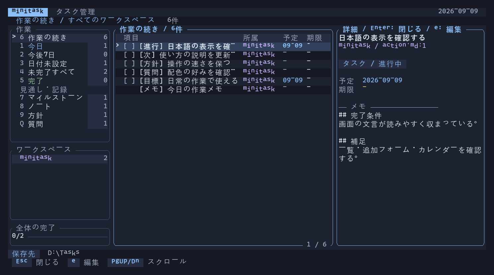

# minitask

Yaziから起動する、作業の続きを思い出すためのタスク管理TUI。workspaceごとのディレクトリに1タスク1Markdownで詳細メモを保存し、Neovim / Emacsで直接編集します。



v0.3.1では[lazygitのテーマ・フォーカス表示](https://github.com/jesseduffield/lazygit/blob/master/docs/Config.md#default)、[btopのパネルとメーター](https://github.com/aristocratos/btop#screenshots)、[Atuinの検索UI](https://github.com/atuinsh/atuin)を参考に、角丸パネル、共通ダーク配色、件数バッジ、完了バー、キー表示を整理しました。絵文字や専用アイコンフォントは不要です。画像はRatatuiの描画データから作成したプレビューで、フォントは端末設定に従います。

## 起動

配布ZIPの利用方法は [導入ガイド](DISTRIBUTION.md) を参照してください。本体・日本語の表示文言・Emacsフロントエンド・LLM用スキルを同梱しています。

Windows x64向けZIPを作成する場合は、RustのMSVCツールチェーンとビルドツールを用意して、次を実行します。

```powershell
powershell -NoProfile -ExecutionPolicy Bypass -File scripts/package.ps1
```

`publish/minitask-<バージョン>-windows-x64.zip` と `.zip.sha256` が生成されます。依存取得済みなら `-Offline` を付けられます。バージョンは `Cargo.toml` から取得し、ライセンス本文は取得済みの依存パッケージとRustのドキュメントから同梱します。Rustのドキュメントがない環境は `rustup component add rust-docs` で追加してください。再実行時は同じバージョンの配布ZIPを置き換えます。

配布物を移動して検証する場合は `python tests/package.py publish/minitask-<バージョン>-windows-x64.zip` を実行します。第2引数にEmacs実行ファイルのパスを渡すとEmacs連携も検証します。公開・アップロードはこのスクリプトでは行いません。

GitHub Actionsの`Windows build and release`は、mainへのpushと手動実行でテスト・ZIP作成・Artifactsへの保存を行います。`Cargo.toml`のバージョンと一致する`v`付きタグをpushすると、同じ検証後にGitHub ReleaseへZIPとSHA256を添付します。例としてバージョン0.6.0の公開操作は次のとおりです。

```powershell
git tag -a v0.6.0 -m "Release v0.6.0"
git push origin v0.6.0
```

タグとバージョンが一致しなければ公開前に停止します。`v0.7.0-rc.1`などはPrereleaseになります。同じタグの再公開は行わず、修正時はバージョンを更新して新しいタグを作成してください。ワークフローは標準の`GITHUB_TOKEN`を使用し、個人アクセストークンの登録は不要です。

Rust 1.89以降でビルドします。TUIはRatatui + Crosstermを使用しています。実行時はRust不要です。

```powershell
cargo build --release --locked
Copy-Item .\target\release\minitask.exe .\minitask.exe
.\minitask.exe
```

保存先の優先順位は `--home` → `MINITASK_HOME` → OSのユーザー設定ディレクトリ下の `minitask`。Windowsの既定値は `%APPDATA%\minitask` です。Yaziの現在位置には依存しません。

```text
minitask/
├── personal/
│   └── 20260909-120000-123456789-買い物.md
├── project-a/
│   ├── 20260909-120001-123456789-リリース準備.md
│   └── 20260909-120002-123456789-調査.md
├── .index.json
└── .state.json
```

初回は「作業の続き」を表示し、`n` でworkspaceを作成します。終了時の表示とworkspaceを次回も開きます。

## 表示と操作

Todoist、Things、TickTick、Linear、Microsoft To Do、OmniFocus、Trello、Taskwarriorの公式資料を参考に、一覧とキーボード操作を整理しました。[調査と適用方針](docs/research/2026-09-08-ui-ux.md)

| キー | 操作 |
| --- | --- |
| `1` / `2` / `3` | 今日 / 今後7日 / 日付未設定（全ワークスペース） |
| `4` / `5` / `0` | 未完了すべて / 完了 / 選択中ワークスペース |
| `6` / `7` | 作業の続き / マイルストーン |
| `8` / `9` / `Q` | ノート / 方針 / 質問 |
| `m` / `v` | マイルストーン追加 / 状態変更（上下で選択、Enterで保存） |
| `Tab` / `Shift+Tab` | 作業 → ワークスペース → タスク一覧を順方向／逆方向に移動 |
| `h` / `l` / 左右矢印 | 左側の選択領域／タスク一覧へ移動 |
| `j` / `k` / 上下矢印 | 選択 |
| `a` / `n` | 現在の表示に応じた項目追加 / workspace作成 |
| `Space` | 選択タスクの完了を切替（タスク側） |
| `u` | 直前の完了切替・日付変更を1回取り消す |
| `Enter` | 詳細を開く／閉じる。表示一覧側ではタスク側へ移動 |
| `e` | 選択タスクの個別Markdownをエディタで開く |
| `c` / `s` / `d` | 月間カレンダー / 予定日設定 / 期限設定 |
| `/` | 現在の表示内を入力中に検索（タイトル・メモ・workspace名・日付） |
| `:` / `?` | コマンドを検索 / 現在の画面のヘルプ |
| `Esc` | 入力・詳細を閉じる／検索を解除 |
| `PgUp` / `PgDn` | 詳細やヘルプをスクロール |
| `r` / `R` | 差分更新／全ファイルを再索引化 |
| `q` / `Ctrl+C` | 終了（入力中のCtrl+Cはキャンセル） |

「今日」は予定日または期限が今日以前の未完了を、期限超過・持ち越し・今日の順に表示。「今後7日」は明日から7日後までに予定日または期限がある未完了。「日付未設定」はどちらの日付もない未完了です。完了タスクは`5`で確認でき、Markdownにはそのまま残ります。起動したまま日付が変わっても表示を更新します。

`a` → タイトル → `Enter`ですぐ追加できます。新規タスクの予定日・期限は、どちらも今日が初期値です（当日中のタスク）。カレンダーからの追加では、どちらも選択した日になります。`Tab`で保存先workspace・予定日・期限に移動し、workspaceは矢印、日付は`YYYY-MM-DD`で変更できます。日付欄を空にすれば未設定で保存できます。全項目を検証してから1回で保存し、エラー時は下書きを残します。

検索中の`Esc`は検索開始前の条件・選択位置に戻り、`Enter`は条件を確定します。確定後の`Esc`は検索条件を解除します。取り消しは起動中だけの1段階で、対象ファイルが保存後に変更されていれば上書きを拒否します。

入力欄では左右矢印・Home/End・Backspace/Deleteが使えます。詳細記入はエディタで行い、タスク削除はそのMarkdownファイルを削除します。画面は40列×12行以上。一覧は1タスク1行で、80列×24行なら17件表示できます。狭い画面は`Tab`でサイドバーを切り替え、詳細は全面表示。120列以上では詳細を右側に表示します。省略されたタイトルと日付の年は詳細で確認できます。

## 表示言語

既定の画面・通知・ヘルプは日本語です。左側は「作業」と「見通し・記録」に分け、作業の続きを先頭に表示します。以前の数字キーはそのまま使えます。

表示文言は [locales/ja.json](locales/ja.json) にまとめています。実行ファイルの隣の `locales/<言語名>.json` を起動時に読み込むため、文言の変更に再ビルドは不要です。編集後はminitaskを起動し直してください。日本語ファイルがなくても、組み込みの日本語で起動できます。

別の言語を追加する場合は `ja.json` をコピーし、キーと `{0}`・`{1}` などの差し込み番号を保ったまま値を翻訳します。配布済みの言語は日本語のみです。部分的な翻訳も使え、未指定の項目は日本語に戻ります。未知のキーや差し込み番号の不一致は起動時に検出します。

```powershell
# locales/en.json を用意した場合
.\minitask.exe --locale en
# 翻訳フォルダを別の場所にする場合
.\minitask.exe --locale en --locale-dir 'D:\minitask-locales'
```

環境変数 `MINITASK_LOCALE` / `MINITASK_LOCALE_DIR` でも指定できます。引数の指定が優先されます。CLIで使う場合、これらの起動オプションは `tasks` などのコマンドより前に置きます。JSONのキー・状態値とMarkdownの管理項目は言語に依存せず、従来の形式を保ちます。ユーザーが書いた本文は翻訳しません。

## Neovim / Emacs

Emacs内で一覧・状態変更・カレンダーまで操作する場合は、[Emacsフロントエンド](docs/emacs.md)を使えます。`M-x minitask`で起動します。以下はTUIから外部エディタを開く場合の設定です。

優先順位は `--editor` → `VISUAL` → `EDITOR` → `nvim`。実行ファイルと引数を指定でき、シェルは経由しません。エイリアス、パイプ、シェル変数展開は使えません。

```powershell
.\minitask.exe --editor nvim
.\minitask.exe --editor 'emacs -nw'
.\minitask.exe --editor 'emacsclient -t'

# PATHにない実行ファイル。引数がある場合はパス部分を二重引用符で囲む。
.\minitask.exe --editor '"C:\Program Files\Emacs\emacs-30.2\bin\emacs.exe" -nw'

# このPowerShellから起動するYaziにも引き継ぐ
$env:VISUAL = 'nvim'
```

Neovimは `:wq`、Emacsは保存後 `C-x C-c` で戻ります。既存サーバーを使う `emacsclient` は `C-x #` で編集を終えます。`emacsclient -n` / `--no-wait` は付けないでください。編集を終えてからTUIが再表示され、対象ファイルを必ず再索引化します。[Emacsの行指定](https://www.gnu.org/s/emacs/manual/html_node/emacs/Action-Arguments.html)・[emacsclientの終了方法](https://www.gnu.org/s/emacs/manual/html_node/emacs/Invoking-emacsclient.html)

## Markdown

UTF-8のObsidianチェックボックス形式で、1ファイルに1タスクを保存します。最初の行頭チェックボックス `- [ ] タイトル` / `- [x] タイトル`（`X`も可）をタスクとして扱い、その下をすべて詳細として表示・検索します。詳細には字下げなしで見出し・段落・リンク・チェックリスト・コードを書けます。

````markdown
- [ ] リリース準備 [scheduled:: 2026-09-10] [due:: 2026-09-12]

## 詳細
告知文とスクリーンショットを用意する。[[関連ノート]]

## 手順
- [ ] Windowsで動作確認
- [ ] READMEを更新

```text
調査結果やコードを記録する
```
````

2つ目以降のチェックボックスは詳細内のチェックリストで、独立タスクとしては索引化しません。最初のタスクを探す際はコードフェンス・YAML frontmatter・Obsidianコメントを除外します。従来のチェックボックスだけのActionは状態の1文字を更新します。状態プロパティ付きの項目はチェックボックスと状態を一緒に更新し、本文・改行・BOMを保持します。

新規ファイル名はUTCの作成日時とタイトルから生成し、同じタイトルでも別ファイルにします。タイトルを編集してもファイル名は変わりません。workspace直下に自分で作成した `.md` も読み込みます。空のディレクトリもworkspaceとして表示されます。サブディレクトリは索引対象に含めません。

### 既存のtasks.mdを分割

```powershell
.\minitask.exe --split-legacy
# 保存先を指定する場合
.\minitask.exe --home 'D:\Tasks' --split-legacy
```

従来の `tasks.md` を個別の `legacy-<hash>-<連番>-<タイトル>.md` に分割します。各タスクから次のタスクまでの本文を残し、旧 `## [ ]` / `## [x]` の先頭だけを通常のチェックボックスに変換します。元ファイルは同じworkspaceの `.tasks-<hash>.bak` にバイト単位で保存します。最初のタスクより前のworkspace見出しやfrontmatterは、このバックアップに残ります。

途中で終了した場合は次回起動時に再開します。分割先に外部変更があれば上書きせず停止します。完了後に再実行しても重複作成しません。閉じていないコードフェンス・コメント・frontmatterがある旧ファイルは、分割前に修正してください。

未分割の `tasks.md` は従来どおり複数タスクとして読み込みますが、新規追加は常に個別ファイルです。`.bak` と隠しファイルは索引対象外です。

## Creative MemoryとHorizon

`6`でResumeを開くと、作業中・着手可能なAction、有効なDirection、未回答のQuestion、Expectation、自由ノートを同じ一覧から確認できます。Actionの作業中を先頭に、その後を種別ごとに並べます。`Enter`で詳細、`e`で編集します。既存の表示状態がある場合はそちらを復元するため、更新後は`6`で切り替えてください。

| 種別 | 用途と状態 |
| --- | --- |
| Action | タスク。backlog / actionable / in_progress / blocked / completed / cancelled |
| Note | 自由記述。状態管理や本文の書式は不要 |
| Direction | 作業方針。active / archived。AGENTS.mdや文書の場所を本文に書いてもよい |
| Question | 質問と回答。open / answered / closed。質問を作るだけでは他Actionを止めない |
| Expectation | 気軽なマイルストーン。日付と期待する状態。open / achieved / dropped |

`8`→`a`でNote、`9`→`a`でDirection、`Q`→`a`でQuestion、`7`→`a`または`m`でExpectationを追加できます。本文は追加後に`e`で記入します。通常の一覧・作業の続きでは`a`でActionを追加します。

````markdown
- [ ] セーブ機能 [kind:: action] [status:: in_progress]

## Completion Condition
ロード後にプレイヤーの位置が復元される。

## Supplement
保存は確認した。次は復元の確認。対象はSaveManager.cs。
````

DirectionとQuestionも先頭のチェックボックスに`[kind:: direction] [status:: active]`や`[kind:: question] [status:: open]`を付け、その下を自由に書けます。状態のない既存タスクは未完了をactionable、完了をcompletedとして読み込みます。

Noteは`note-<作成日時>-<タイトル>.md`というファイル名で識別します。本文には一切構造を要求せず、見出しを消してもチェックリストを書いてもNoteのままです。最初の空でない行を一覧のタイトルに使います。この`note-`接頭辞はNote用に予約されています。

```markdown
- [ ] 一通り遊べる [kind:: expectation] [expectation:: 2026-09-30]

細部は仮でもよい。最初から最後まで通せる状態。
```

Expectationは通常のAction件数や期限超過判定に含めません。マイルストーンで日付順に表示し、カレンダーではその日にActionと並べます。`s`または`d`で日付を変更し、達成・取り下げは`v`で変更します。Expectationの日付は必須ですが、完了条件やタスクへの分解は不要です。

`v`は可能な遷移だけを受け付け、`Space`は完了・達成・回答済み・アーカイブと再開を切り替えます（Noteを除く）。例えばActionのblockedからcompleted、completedからin_progressへの直接遷移は拒否します。Actionを作業一覧から外す場合はcancelled、再開時はactionableへ戻します。人間は内容を確認して操作し、LLMのCLI操作では完了条件と検証結果の記入も要求します。

Markdownを直接編集すると遷移検証は経由しません。チェックボックスと状態の矛盾や不正な状態値は検出して表示します。本文は自動修正せず、LLMのResumeでは`issues`に分けます。

## LLM向けCLI

LLM用のスキルは [using-minitask](skills/using-minitask/SKILL.md) です。スキル対応環境のスキルフォルダへ `skills/using-minitask` を配置し、`$using-minitask` で呼び出します。例えば「minitaskの開発ワークスペースで作業の続きを確認して」のように依頼できます。対応ランタイムでは依頼内容からの自動選択も可能です。

作業再開、質問待ちの扱い、完了条件の検証、ID・ハッシュによる更新、自由ノートとマイルストーンの操作をまとめています。[検証記録](docs/validation/using-minitask.md)。CLI例の再検証は `python tests/skill_cli.py`（ビルド済み実行ファイルとPowerShellが必要）で行えます。

「minitaskの開発ワークスペースで、独立したタスクを並行して進めて」と依頼すると、サブエージェント対応環境では複数のActionを分担します。複数のタスクを同時に進行中にでき、親LLMが管理記録の更新と各タスクの完了確認を行います。同じファイルを編集する作業や成果に依存する作業は順番に進めます。

```powershell
.\minitask.exe resume --workspace ToReturn --json
.\minitask.exe tasks --workspace ToReturn --status in_progress
.\minitask.exe expectations --workspace ToReturn --from 2026-09-01 --to 2026-09-30
.\minitask.exe questions --workspace ToReturn --status open
.\minitask.exe show --id 'ToReturn/example.md'
```

取得コマンドはJSONを返し、TUIを開いたまま実行できます。`--home`を指定する場合はコマンドより前に置いてください。作成・状態変更・日付変更のCLIと、LLMの再開・質問・検証の手順は[LLM向けガイド](docs/llm.md)にまとめています。

## 日付とカレンダー

日付は `[scheduled:: YYYY-MM-DD]`（予定日）と `[due:: YYYY-MM-DD]`（期限）。両方とも省略できます。保存データとTUIに絵文字は使いません。この日付表記はObsidian本体のプロパティではなく、[TasksのDataview形式](https://github.com/obsidian-tasks-group/obsidian-tasks/blob/main/docs/Reference/Task%20Formats/Dataview%20Format.md)です。Obsidian Tasksで日付として扱う場合は、その設定のTask formatをDataviewにしてください。minitask単体ではプラグイン不要です。

`c`で月間カレンダーを開きます。選択タスクに日付があればその日、なければ今日を表示します。月曜始まりで、日付の下段にタスク件数を表示し、同じ日に予定と期限が重なったタスクは1件と数えます。今日には下線、選択日には背景色と`>`が付きます。

| キー | カレンダーでの操作 |
| --- | --- |
| `h/j/k/l` / 矢印 | 日付移動（上下は1週間） |
| `PgUp` / `PgDn` | 前月／翌月。移動先に同じ日がなければ月末 |
| `t` | 今日へ移動 |
| `w` | 選択workspace／全workspaceを切替 |
| `Tab` | 日付／タスク一覧のペイン移動 |
| `Enter` | 日付側ではタスク一覧へ移動、タスク側では詳細表示 |
| `j/k` / 上下矢印 | タスクペインで選択移動 |
| `a` | 選択日を予定日にしてタスク追加 |
| `s` / `d` | 選択タスクの予定日／期限を編集 |
| `Space` / `e` | タスクペインで完了切替／エディタで編集 |
| `c` / `Esc` | 通常の一覧へ戻る |

日付編集では同じキーで日・月を移動し、`1`今日・`2`明日・`7`1週間後も選べます。`i`で`YYYY-MM-DD`を直接入力、`Enter`で保存、`0`または`Delete`で日付解除、`Esc`でキャンセル。`?`でヘルプを開きます。エディタでタスク行末の日付を直接編集することもできます。不正な日付や同じ項目の重複は一覧に `日付エラー` と表示し、カレンダーには集計しません。エディタで修正してから日付を設定してください。

未完了で期限が今日より前のタスクは「期限超過」と表示します。完了タスクもカレンダーに残ります。日付なしタスクは通常の一覧で管理します。70列×22行以上ではカレンダーとタスクを左右に表示。それより狭い場合は`Tab`で切り替え、高さが足りなければ選択週周辺を表示します。

## インデックス

- `.index.json` にファイルの更新時刻・サイズ・ハッシュ、タスクのタイトル・状態・詳細・日付・行位置を保存。以前の索引は新形式で一度再生成します。
- 起動時と2秒ごとの変更確認では、更新されたファイルだけを読み込み・解析。通常の選択・検索はメモリ上で処理。
- エディタから戻った直後とTUIからの変更後は、更新時刻にかかわらず対象ファイルを解析。
- 索引が欠損・JSON破損していれば再生成。`R` または `minitask --reindex` でも再生成可能。
- 外部ツールがサイズと更新時刻の両方を維持した場合、通常の差分検出には出ないため `R` を使用。
- 検索はキャッシュした文字列の部分一致走査で、転置索引ではありません。対象表示のタスク数に比例します。描画は画面に収まる行だけを組み立てます。

`.index.json` と `.state.json` は削除してもタスク本文は失われません。同じ保存先のminitaskは同時起動を防止し、ロックはプロセス終了時にOSが解除します。Markdownへの更新は一時ファイルへ書いて置換し、外部変更を検出したら古い選択による更新を拒否します。外部エディタから同じファイルへ同時に保存する運用は避けてください。

## YaziのCtrl+T

展開先をPATHに追加し、`yazi-keymap.toml` の例をYaziの `keymap.toml` に追加します。既存のCtrl+T割当がある場合は、その `run` と `desc` を置き換えます。

```toml
[[mgr.prepend_keymap]]
on = "<C-t>"
run = 'shell "minitask" --block'
desc = "minitaskを開く"
```

設定変更後はYaziを再起動してください。終了するとYaziへ戻ります。[Yaziのshell設定](https://yazi-rs.github.io/docs/configuration/keymap/#shell)

## 検証

```powershell
cargo test --locked
cargo clippy --all-targets -- -D warnings
cargo test --release --test workflow index_benchmark -- --ignored --nocapture
cargo test --release --test ux interaction_benchmark -- --ignored --nocapture
```

Neovim / EmacsがPATHにあれば実プロセスの編集テストも動きます。EmacsだけPATH外の場合は `MINITASK_TEST_EMACS` に実行ファイルの絶対パスを指定できます。

旧v0.3系の参考測定（現在のエンティティ形式・CLIの性能値ではありません）。Windows / Core i7-14700K、100ファイル×100タスク（予定日・期限・日本語メモ付き）、3回の中央値: 全再索引化19.9ms、既存索引からの起動処理5.3ms、変更なしの確認1.55ms。ベンチマークはOSキャッシュが温まった状態で、端末初期化・描画・エディタ起動時間は含みません。

Go版のMarkdown・`.state.json`も読み込めます。索引は必要に応じて再生成します。exeを同じ場所に配置するため、既存のYaziのCtrl+T設定もそのまま使えます。

UI測定（同じWindows環境、100workspace×100タスク、120×30、11回の中央値）: 一覧描画0.39ms、検索と描画3.77ms、日付移動と描画0.43ms（v0.3.1）。Ratatui TestBackendでの処理時間で、実端末への転送・表示時間は含みません。
